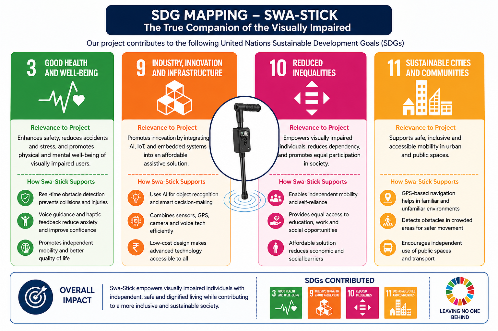
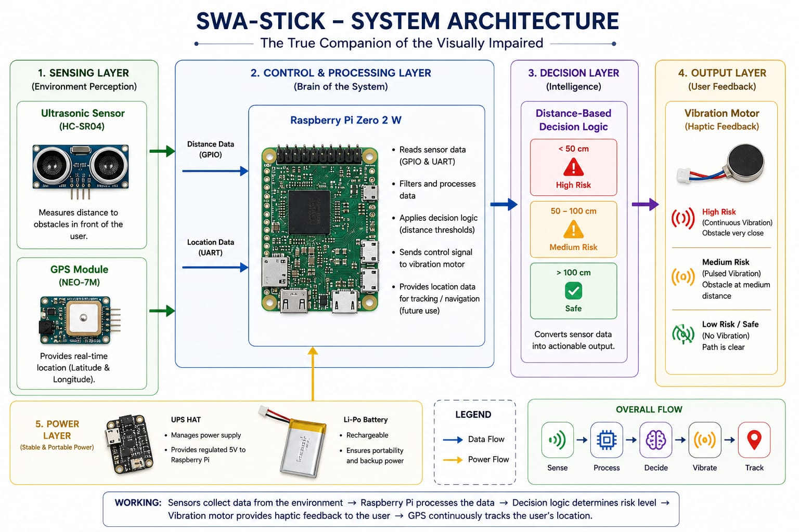

# Swa-Stick — AI Assistive Navigation System

AI-enabled smart assistive navigation system designed to improve mobility, safety, and independence for visually impaired individuals using embedded systems, computer vision, IoT, and intelligent feedback mechanisms.

---

## Overview

Swa-Stick combines obstacle detection, GPS navigation, voice assistance, OCR-based text recognition, and haptic feedback into a compact embedded solution powered by Raspberry Pi.

The project aims to provide an affordable and intelligent mobility aid capable of real-time environmental awareness and navigation assistance.

---
## SDG Mapping



---

## System Architecture


---
## Key Features

- Real-time obstacle detection
- AI-assisted environmental awareness
- GPS-based navigation assistance
- Voice interaction and audio feedback
- OCR-based text recognition
- Haptic vibration alerts
- Embedded edge-AI processing
- Portable low-power architecture

---

## Technologies Used

### Hardware
- Raspberry Pi Zero 2W
- Ultrasonic Sensors
- GPS Module (L86)
- INMP441 MEMS Microphone
- MAX98357 Audio Amplifier
- Li-Po Battery System
- Vibration Motors

### Software
- Python
- OpenCV
- TensorFlow Lite
- Tesseract OCR
- Google Maps API
- Speech-to-Text / Text-to-Speech

---

## System Architecture

The system continuously captures environmental data using ultrasonic sensors, camera modules, GPS, and voice inputs.

A Raspberry Pi processes the collected information locally and provides:
- audio-based navigation guidance,
- obstacle alerts,
- object recognition,
- and haptic feedback.

---

## Repository Structure

```text
hardware/   → Circuit diagrams and hardware resources
software/   → Python source code and AI modules
images/     → Architecture diagrams and setup images
docs/       → Reports, presentations, and documentation
```

---

## SDG Alignment

This project contributes toward:
- SDG 3 — Good Health and Well-Being
- SDG 9 — Industry, Innovation and Infrastructure
- SDG 10 — Reduced Inequalities
- SDG 11 — Sustainable Cities and Communities

---

## Research & Documentation

This repository includes:
- Major project report
- Technical documentation
- System architecture diagrams
- Literature review
- Market analysis
- Testing methodology
- Project presentations

---

## Future Improvements

- Advanced computer vision models
- Cloud connectivity
- Mobile application integration
- Emergency assistance features
- Improved battery optimization

---

## Authors

- Swayam Dalvi & Team Members


Department of Electronics & Telecommunication Engineering  
Don Bosco Institute of Technology, Mumbai
